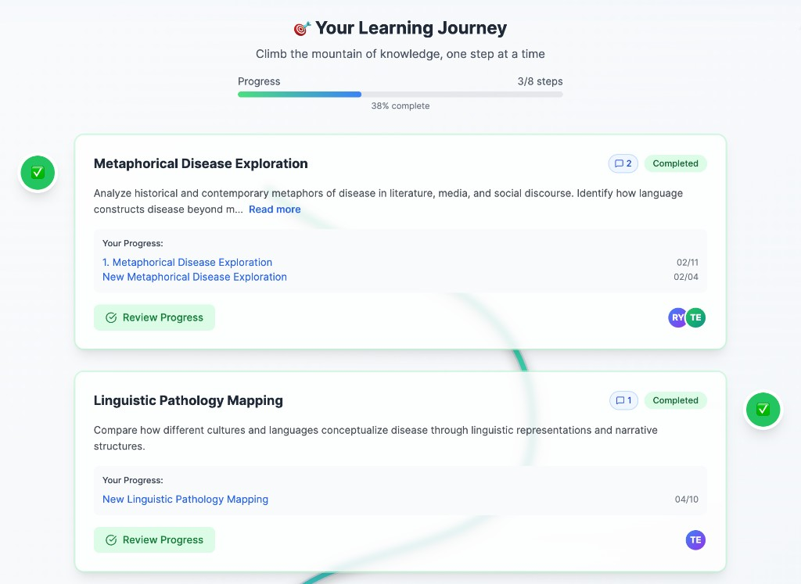
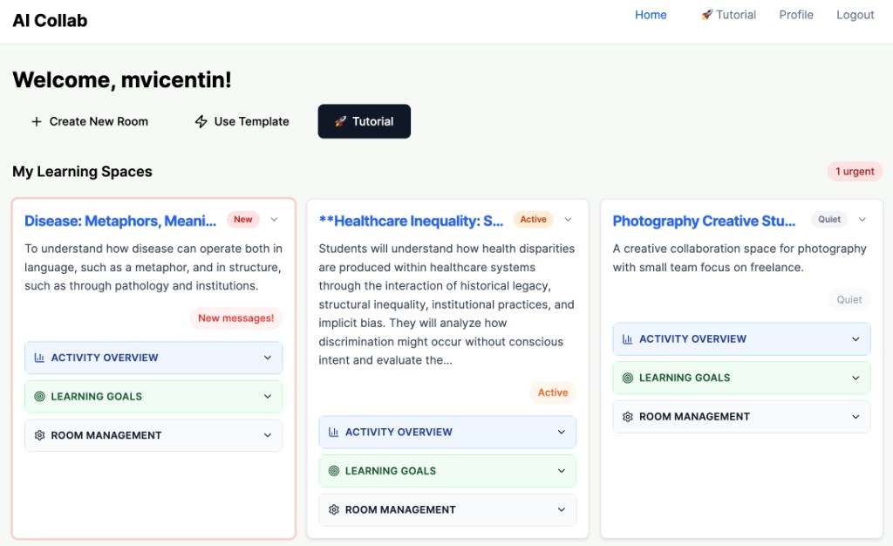
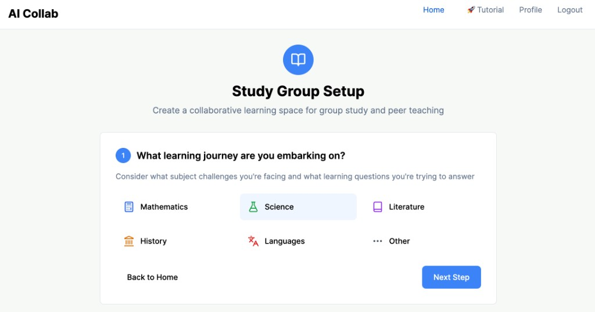
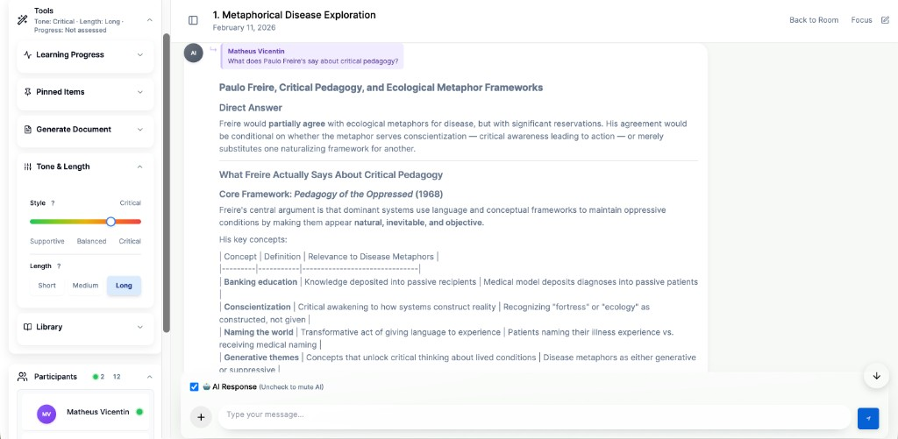

# AI Collab Online

**Collaborative learning rooms where AI and structure meet:** learners and teams progress through guided steps, carry context **across chats** (not only the latest thread), and export real artifacts—without treating the product as “just another chatbot in a doc.”

| | |
|:---|:---|
| **What it is** | A web app for **rooms**, **structured journeys** (e.g. writing / study paths), **multi-user chat**, and **context-aware AI** tied to goals and history. |
| **Who it’s for** | **Students**, **writing groups**, **educators**, and **small teams** who learn through dialogue and need continuity between sessions. |
| **Problem it solves** | Plain chat and static forums **lose thread and progress**; generic AI **forgets** earlier work in the same course or project. |
| **Why it’s different** | **Cross-chat memory** (notes, welcomes, progression), **pin-seeded** focused chats, **presence**-aware collaboration, and **prompt assembly** tuned to mode, tone, length, documents, and multi-speaker threads—not a single isolated Q&A pane. |

[](https://github.com/writeian/Collab_AI_Online)
[](LICENSE)
[](https://python.org)

---

## Live

- **App:** https://collab.up.railway.app  
- **Health:** https://collab.up.railway.app/health  

---

## Visual proof

| **Learning journey** — progress, modules, collaboration | **Home** — rooms, goals, activity |
|:---:|:---:|
|  |  |

| **Study group setup** — template / wizard step | **Chat** — Tone & Length, presence, structured AI |
|:---:|:---:|
|  |  |

More context and a text walkthrough: **[DEMO.md](DEMO.md)**.

---

## Why this isn’t “ChatGPT in a Google Doc”

| Typical setup | **AI Collab Online** |
|---------------|----------------------|
| **Shared doc + side chat** | **Room + journey** as the spine; chats are steps in a path, not loose margins. |
| **ChatGPT / copilot in a doc** | **Cross-chat learning context**: milestones, notes, and welcomes that **reference prior chats** in the same room. |
| **Slack / Discord + a bot** | **Structured templates** (e.g. essay steps, study group modes), **rubric-style** controls, and **exports** (notes / outlines / docx)—not only channel scrollback. |
| **LMS discussion boards** | **Real-time collaboration**, **presence**, **pin-seeded synthesis** chats, and **adaptive** AI (tone, length, archetypes, document library) in one product. |

---

## One concrete workflow

A **student writing group** creates a **room** with an academic-essay (or workshop) template. They **chat through drafting steps**; at milestones, the system can **generate notes** that feed **later chats**. They tune **Tone & Length**, optionally **attach library documents**, and **export** an outline or transcript. They **open a new chat** for the next step—**welcome messages and progression** can **reuse prior context** so they are not starting from zero every time.

That single path hits structured progression, AI, collaboration, and continuity—without listing every feature.

---

## Technical highlights *(for collaborators & hiring managers)*

- **Cross-chat memory** — note generation triggers, `ChatNotes`-style persistence, context pulled into new conversations.  
- **Context-aware prompt assembly** — mode prompts, optional document retrieval, tone/length/archetype layers, **multi-participant “weaving”** in recent history.  
- **Pin snapshot persistence** — pin-seeded chats keep a **frozen pin payload** (`PinChatMetadata`) so AI context does not drift when sources move.  
- **Collaborative presence** — heartbeats and sidebar “who’s active”; busy-room heuristics (e.g. default shorter replies when activity spikes).  
- **Resilient AI plumbing** — Anthropic-first with **failover** (`AI_FAILOVER_ORDER`), streaming paths, and template fallbacks when providers degrade.  

Deeper stack and diagrams: **[ARCHITECTURE.md](ARCHITECTURE.md)**.

---

## Quick start (local)

```bash
git clone https://github.com/writeian/Collab_AI_Online.git
cd Collab_AI_Online
python3.11 -m venv venv && source venv/bin/activate
pip install -r requirements.txt
cp env_template.txt .env    # add SECRET_KEY + ANTHROPIC_API_KEY; see DEVELOPMENT.md
python run.py               # → http://localhost:5001
```

The app **creates its local SQLite schema on first boot** (`db.create_all()` plus an additive column reconciler), so no migration step is needed to run locally. The Alembic migrations under `migrations/` are **Postgres-only** (they gate on `information_schema`) and are meant for the production database, not local SQLite.

Shorter checklist: **[SETUP_LOCAL.md](SETUP_LOCAL.md)**.

---

## Documentation map *(README = front door; depth lives here)*

| Doc | Purpose |
|-----|---------|
| **[FEATURES.md](FEATURES.md)** | Full capability breakdown (what the product does). |
| **[CHANGELOG.md](CHANGELOG.md)** | Release-style **recent updates** (was “Recent Major Updates” in the old README). |
| **[ARCHITECTURE.md](ARCHITECTURE.md)** | Stack, distinctive design choices, high-level layout. |
| **[DEVELOPMENT.md](DEVELOPMENT.md)** | Env vars, tests, linting, project tree, macOS case note. |
| **[DEPLOYMENT.md](DEPLOYMENT.md)** | Railway / production entry points and links. |
| **[DEMO.md](DEMO.md)** | Screenshots, walkthroughs, example outputs *(you fill in media)*. |
| **[EXAMPLES.md](EXAMPLES.md)** | Pointer to demo/output samples (same content as DEMO for now). |

---

## Branches & deploy

- **Production:** `updated-edu-tools` — the live branch **Railway** builds and deploys to [collab.up.railway.app](https://collab.up.railway.app). Changes land here via reviewed pull requests.
- **`dev`:** legacy skeleton kept for history — **not** the current product; don't branch new work off it.

Railway auto-builds whenever `updated-edu-tools` is updated:

```bash
git checkout updated-edu-tools && git pull --ff-only
# open a PR into updated-edu-tools; Railway builds on merge
```

After a deploy, **hard-refresh** the browser so cache-busted static assets pick up.

---

## Environment (minimal)

You need at least **`SECRET_KEY`**, **`ANTHROPIC_API_KEY`** (for AI), and a database (**`DATABASE_URL`** for Postgres; SQLite locally if configured). Full lists and optional flags: **[DEVELOPMENT.md](DEVELOPMENT.md)** and **`env_template.txt`**.

---

## Contributing, support, license

- **Contributing:** [CONTRIBUTING.md](CONTRIBUTING.md)  
- **Issues:** [GitHub Issues](https://github.com/writeian/Collab_AI_Online/issues)  
- **License:** [MIT](LICENSE)  

**Thanks:** Anthropic (Claude API), Flask & Tailwind communities, and contributors.

---

**Made for educators, students, and writing teams who want learning to accumulate—not reset every new chat.**
